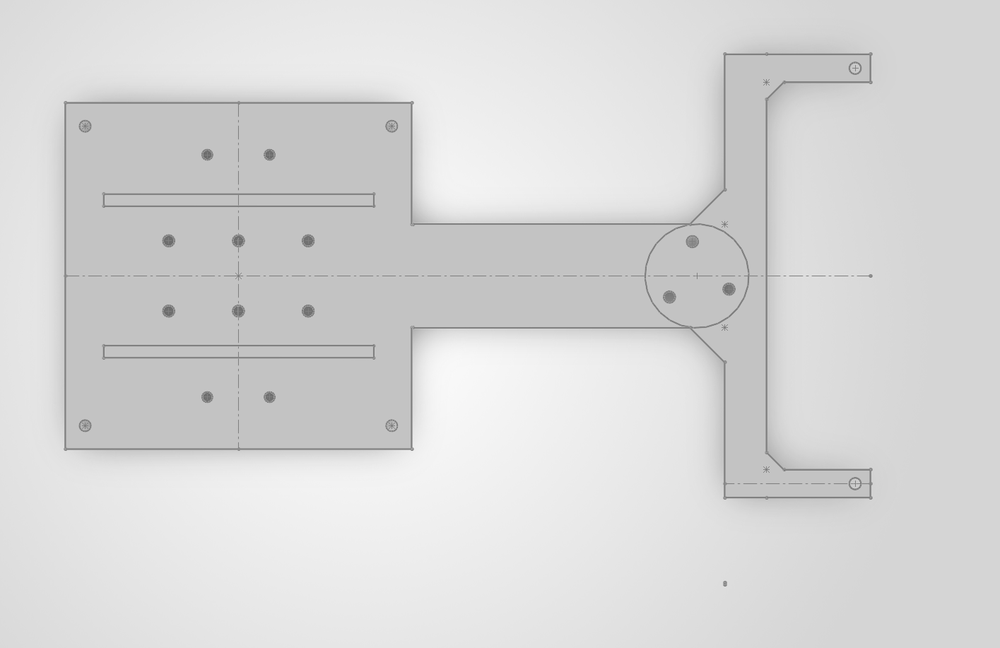
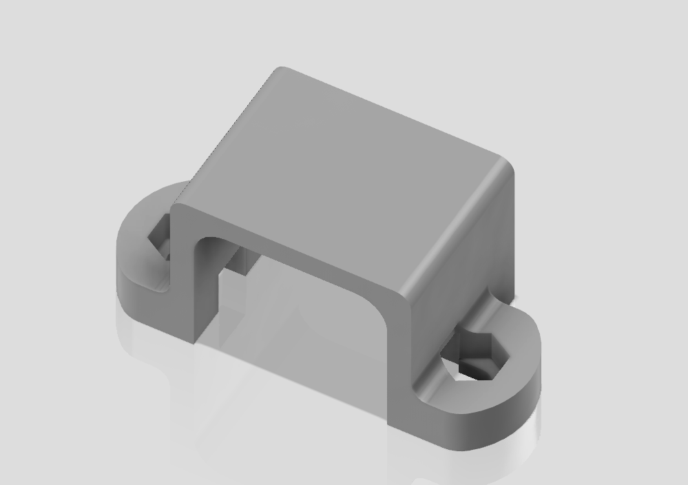

# Line Following Robot

A compact line-following robot designed around an ESP32, N20 geared motors with encoders, and an adjustable analog IR sensor array.

The chassis went through **three main design stages** — V1, V2, and V2 Final — before settling on a simpler, more practical, and more printable layout. This README documents each stage in order, including what changed and why.

---

## Components

### Electronic

- **Microcontroller:** ESP32
  - Specific version: __________
- **IR Sensor Array:** Analog straight IR sensor array
- **Motor Driver:** __________
- **Battery:** 2 × 2.7 V Li-ion batteries
- **Battery Holder:** 1 × __________
- **Power Converter / Buck Converter:** __________

### Mechanical

- **Motors:** 2 × N20 6 V geared motors with encoders
- **Wheels:** 2 × high-traction 32 mm wheels
- **Caster Wheel:** 1 × caster ball mount
- **Chassis:** Custom CAD-designed chassis
- **Fasteners:** M2.0 nuts and screws

---

## Chassis Design History

### V1 — Curved IR Array Design (Dropped Early)


The first version was designed around a **curved IR sensor array**. The idea was to place the sensors along a curved front section so the array could cover a wider area while following the line. The chassis also had to accommodate the required sensor mounting holes and spacing.

This version was **abandoned very quickly**, before it went far into detailed CAD, once two major problems became clear:

1. **Coding complexity** — A curved sensor arrangement requires more complicated sensor mapping and calibration. Since the sensor positions aren't evenly aligned along a straight line, converting the readings into a reliable position/error value is more difficult.
2. **CAD hole spacing** — Getting the correct hole positions, lengths, and widths for the curved arrangement became a problem almost immediately during modelling. Small changes in sensor dimensions or mounting positions affected the rest of the chassis.

Rather than pushing through these issues, the curved-array design was dropped early in favour of a simpler straight sensor arrangement, which became V2.

---

### V2 — Straight Array with Diagonal Slots


V2 replaced the curved array with a **straight analog IR sensor array**, since sensors on a single straight line are far easier to read, calibrate, and map to a position/error value.

**Key changes from V1:**

- Replaced the curved IR array with a straight analog IR array.
- Added a **long straight mounting slot** for the IR sensor/PCB, so sensor position could be adjusted instead of fixed.
- Improved the PCB mounting arrangement.
- Added two large rectangular recessed/extruded sections for the battery holder, so it sits securely instead of shifting during operation.
- Battery holder/PCB could be secured further with mounting screws if needed.

**Why diagonal slots were used for mounting holes:**

At this stage, most of the mounting holes (not just the IR sensor mount) were also cut as **diagonal/angled slots** rather than fixed circular holes. The reasoning at the time was to build in extra tolerance — since the chassis depends on several separate components (motors, PCB, battery holder) lining up together, slots gave room to shift each part slightly during assembly to compensate for small CAD or print inaccuracies, without needing to redesign or reprint the chassis. It felt like a safer, more forgiving choice while the exact component dimensions were still being finalised.

This made V2 more flexible during initial assembly, but it introduced a new problem that only became clear once parts were actually mounted and tested — covered in V2 Final below.

---

### V2 Final — Fixed Holes + Reduced Width



V2 Final keeps the straight IR array and general layout from V2, but corrects two problems discovered after building and testing V2: loose mounting and a chassis that didn't fit the printer.

**Change 1 — Diagonal slots removed, replaced with fixed holes:**

The diagonal slots used for general mounting in V2 were **removed and replaced with fixed-position circular holes** at defined spacing.

The extra tolerance from slots turned out to cause more problems than it solved: mounting screws sat loose inside the slots instead of clamping tightly, letting the PCB and brackets shift slightly under vibration or load from the motors. Fixed holes with accurate, pre-calculated spacing removed that play entirely, giving a tighter, more repeatable, more rigid assembly. The one exception is the **IR sensor mount**, which intentionally keeps its slot, since sensor position genuinely needs to be tunable during testing — that's a case where adjustability is a feature, not a workaround.

**Change 2 — Overall chassis width reduced:**

The original V2 chassis was too **long to fit flat on the 3D printer's build plate**. The only way to print it at that size would have been to stand it up at an angle and rely on support structures, which was rejected for three reasons:

1. **Resource waste** — angled printing with supports uses a large amount of extra filament that just gets discarded afterward.
2. **Holes get blocked by supports** — mounting and sensor holes risked being filled in or distorted by support material generated underneath them, requiring cleanup and risking inaccurate final dimensions.
3. **Excessive print time** — for a relatively simple, flat chassis part, printing vertically with supports takes far longer than justified.

To avoid all three issues at once, the chassis **width was reduced** so the entire part fits flat on the print bed in a single orientation, with no supports required.

**Net result:** V2 Final is more rigid (no loose slots except where needed) and cheaper/faster to print (flat, no supports) than V2 — without losing any of the functional improvements V2 made over V1.

---

## Chassis Design Features

### Adjustable Sensor Mount

A straight slot is provided for the IR sensor array, allowing it to be moved forward or backward during testing to find the best position for line detection and turning performance. This is the one mount that intentionally keeps a slot across every revision, since sensor position genuinely needs to be tuned during testing.

```text
        IR SENSOR ARRAY
    ─────────────────────
          ↑       ↑
       Adjustable slot
    ─────────────────────

             CHASSIS
```

### Fixed Mounting Holes (V2 Final)

The diagonal mounting slots used in V2 have been replaced with **fixed circular holes** at defined spacing in V2 Final, visible in `Final_chasis.png`.

This affects the main PCB/electronics mounting holes and the motor-side mounting pattern. Fixed holes were chosen over slots because:

- Slots allowed the mounting screws to sit loose rather than clamping tightly.
- Loose screws risk shifting the PCB or bracket position over time, especially with vibration from the motors.
- Fixed holes with accurate spacing give a more rigid, repeatable assembly once tightened.

### Reduced Chassis Width (V2 Final)

The V2 chassis length exceeded the 3D printer's flat build area. Printing it as-is would have required standing the part up at an angle with support structures, which was rejected for three reasons:

- **Wasted material** — supports consume significant extra filament for no functional benefit.
- **Blocked holes** — mounting and sensor holes could get filled or distorted by support material underneath them.
- **Long print time** — a simple flat chassis shouldn't need a lengthy angled/supported print.

The chassis width was reduced in V2 Final so the whole part prints flat on the bed in one orientation, with no supports needed.

### Battery Mount

Two large rectangular sections provide a stable location for the battery holder. It can be placed on top of the base and secured with mounting screws if required, preventing the batteries from shifting during sharp turns.

### Caster Ball Mount


The caster ball mount (`Caster_Ball_Mount.SLDPRT`) is currently a **working/scratch file**, kept separate from the main chassis so it can be freely edited and iterated on.

It's being used to test and lock down:

- Motor mounting hole positions and spacing for the 2 N20 motors
- Final caster ball mounting height and hole dimensions relative to the wheels

Once the correct dimensions are confirmed through physical testing, the finalised values will be transferred into the main chassis file (`Chasis_final.SLDPRT`).

### Bracket



A supporting bracket part (`Bracket.SLDPRT`) used alongside the chassis assembly.

---

## CAD Design

The chassis was designed with emphasis on:

- Simple manufacturability
- Adjustable sensor positioning
- Easy PCB mounting
- Secure battery placement
- Low unnecessary material
- Easy access to electronics
- Compatibility with N20 motors and 32 mm wheels
- Fitting flat on the 3D printer bed without supports

Final chassis dimensions and hole positions may still be adjusted after physical testing, since actual component tolerances can differ from CAD dimensions.

### CAD Change Log (Chronological)

| Stage | Change | Reason |
|---|---|---|
| V1 → V2 | Curved IR array replaced with straight IR array | Curved layout caused sensor-mapping/coding complexity and CAD hole-spacing problems |
| V2 | Diagonal/angled slots used for general mounting holes | Intended to give tolerance for component/print inaccuracies during assembly |
| V2 → V2 Final | Diagonal slots removed, replaced with fixed circular holes at defined spacing | Slots left mounting screws too loose, allowing PCB/bracket shift under vibration or load |
| V2 → V2 Final | IR sensor mounting slot retained | Sensor position still needs to be adjustable during testing, unlike the other mounts |
| V2 → V2 Final | Overall chassis width reduced | Original V2 length didn't fit flat on the print bed; avoids wasteful angled/supported prints |

---

## Assembly

1. Mount the two N20 motors to the chassis.
2. Install the 32 mm wheels on the motor shafts.
3. Install the caster ball mount.
4. Mount the ESP32 and motor driver.
5. Install the analog IR sensor array in the adjustable slot.
6. Place the two Li-ion batteries in the battery holder.
7. Secure the battery holder using the provided mounting arrangement.
8. Connect the motors, encoder outputs, IR array, ESP32, motor driver, and power system.
9. Test the sensor position before permanently tightening the mounting screws.

---

## Design Considerations

One of the main problems throughout the CAD stage was **hole placement and dimensional accuracy**. Since the chassis depends on several different components being mounted together, even a small error in hole spacing or width can cause problems during physical assembly.

V1 was dropped almost immediately because a curved sensor layout compounded both coding complexity and CAD hole-spacing issues, so effort was redirected into a straight-array design (V2) very early.

V2 initially used diagonal slots liberally across the mounting holes, treating adjustability as a safety margin against CAD or print inaccuracy. In practice, this backfired — slots meant to smooth over minor errors and screws sat loose instead of clamping, letting parts shift under vibration. V2 Final corrected this by converting general mounting holes to fixed positions with accurate spacing, keeping a slot only where adjustability is a genuine functional requirement (the IR sensor mount).

Manufacturability on the actual printer also forced a change in V2 Final. The original V2 length couldn't fit flat within the print bed, and printing it angled with supports would have wasted filament, risked blocking holes with support material, and taken far longer than justified for a simple flat part. Reducing the chassis width solved all three problems at once by keeping the whole print flat and support-free.

---

## Testing Checklist

- Motor mounting hole alignment
- Wheel clearance
- Caster height
- IR sensor height from the track
- IR sensor position relative to the wheels
- Battery holder fit
- PCB mounting holes
- Screw clearance
- Cable routing
- Overall chassis balance
- Fixed mounting holes are tight with no play (post slot-removal)
- Chassis prints flat on the bed without supports

---

## Future Improvements

- Finalising the exact ESP32 variant
- Finalising the motor driver
- Improving PCB mounting
- Adding dedicated cable-routing holes
- Reducing unnecessary chassis material
- Adding more adjustable mounting points only where genuinely needed
- Testing different IR sensor positions
- Locking down motor mounting and caster ball mounting dimensions
- Optimising the chassis after the first physical prototype

---

## Repository Structure

```text
.
├── Cad/
│   ├── Bracket-1.PNG
│   ├── Bracket.SLDPRT
│   ├── Caster ball mount.png
│   ├── Caster_Ball_Mount.SLDPRT
│   ├── Chasis Final.png
│   ├── Chasis V1.png
│   ├── Chasis.SLDPRT
│   ├── Chasis_final.SLDPRT
│   └── Final_chasis.png
├── Docs/
│   └── Components/
├── Firmware/
├── BUILDLOG.md
└── README.md
```

---

## Current Status

| Part | Status |
|---|---|
| N20 6 V Motors | Selected |
| ESP32 | Selected — version TBD |
| Motor Driver | TBD |
| IR Sensor | Straight analog array |
| Battery | 2 × Li-ion |
| Battery Holder | Selected |
| Wheels | Selected |
| Chassis V1 | Dropped early (curved array issues) |
| Chassis V2 | Superseded (diagonal slots caused loose mounting) |
| Chassis V2 Final | Current design (`Chasis_final.SLDPRT` / `Final_chasis.png`) |
| PCB Mounting | Fixed holes (slots removed in V2 Final) |
| Chassis Width | Reduced in V2 Final to fit print bed flat |
| Adjustable IR Mount | Added, retained through all revisions |
| Battery Mount | Added |
| Caster Ball Mount | In progress — scratch file for dimension testing |

---

## Notes

This chassis is still a prototype. Final dimensions may change after testing the actual motors, wheels, sensor array, battery holder, and electronics together.

**V1** was only a brief exploration — dropped very quickly once the curved sensor array introduced compounding coding and CAD problems.

**V2** introduced the straight sensor array and adjustable mounts, but used diagonal slots for general mounting holes to allow for assembly tolerance — a choice that later proved to make the assembly too loose.

**V2 Final** fixed both remaining issues from V2: mounting slots were converted to fixed, precisely spaced holes for rigidity, and the chassis width was reduced so the part prints flat on the bed without wasteful, hole-blocking, time-consuming angled supports.

The main goal of the current (V2 Final) design is to keep the robot simple, rigid where it needs to be, adjustable only where it matters, and easy to manufacture on the available 3D printer.
</content>
